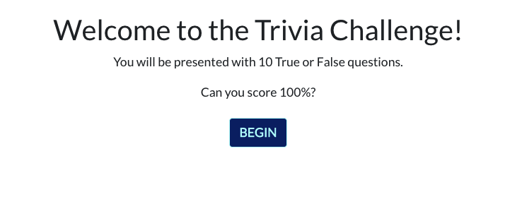
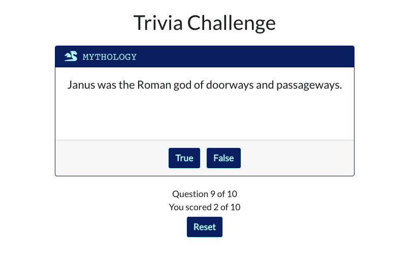
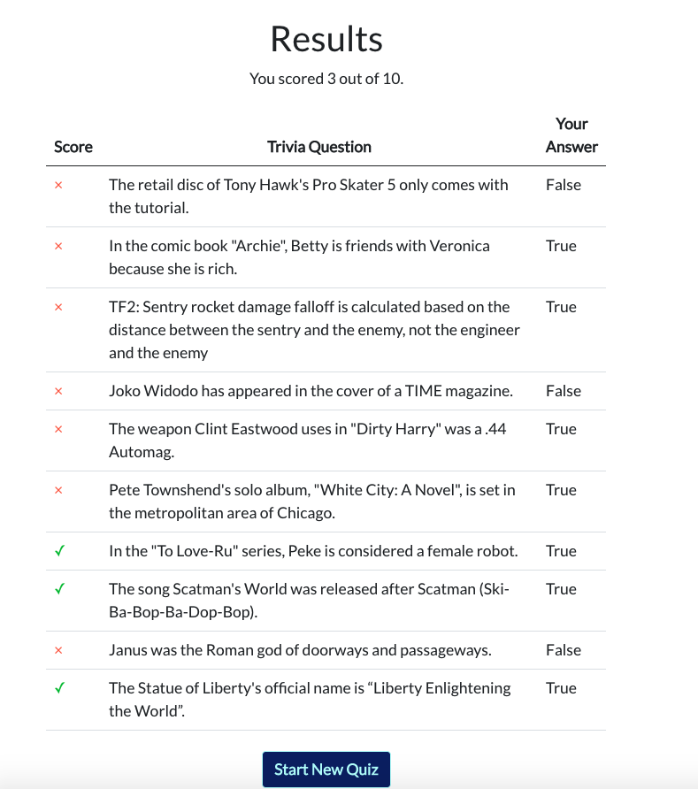

# Trivia Challenge

This React app provides a user interface that lets you play a ten-question trivia game. It uses this API: https://opentdb.com/api.php?amount=10&difficulty=hard&type=boolean

# Running this Project

Clone this repo and run:

```
npm install
npm start
```

# Screenshots

### Landing Page

When you open the app, it loads ten trivia questions. To start the quiz, click **Begin.**



### Trivia Question Detail Page

Ten detail pages are presented one at a time. To go to the next page, guess if the trivia is true or false.

The category of each trivia challenge is on the detail page.



### Results

The results page shows you how many trivia challenges you got right.

To start over with a new set of questions, click **Start New Quiz.**


